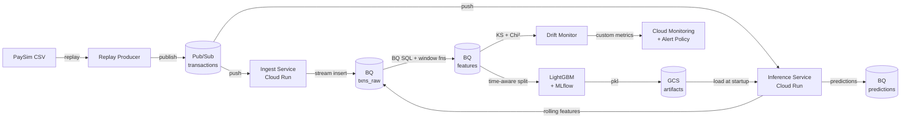

# Fraud Detection MLOps Pipeline

[](https://github.com/Ryqn0/fraud-mlops/actions/workflows/ci.yml)
[](https://github.com/Ryqn0/fraud-mlops/actions/workflows/cd.yml)

End-to-end real-time fraud detection system built on GCP. Streaming transactions flow through Pub/Sub into a LightGBM scoring service, with automated drift monitoring, CI/CD, and BigQuery as the analytical backbone.

**Stack:** Python · LightGBM · FastAPI · Cloud Run · Pub/Sub · BigQuery · Cloud Monitoring · GitHub Actions · Docker · MLflow

---

## Architecture



---

## System components

| Component | What it does | Tech |
|---|---|---|
| **Replay producer** | Replays PaySim CSV as a time-paced stream | Python, Pub/Sub client |
| **Ingest service** | Receives Pub/Sub push messages, validates, writes to BQ | FastAPI, Cloud Run |
| **Feature pipeline** | Batch-computes rolling velocity features via SQL window functions | BigQuery SQL |
| **Training pipeline** | Trains LightGBM with time-aware split, logs to MLflow | LightGBM, MLflow |
| **Inference service** | Scores live transactions: static features from payload + rolling features from BQ | FastAPI, Cloud Run |
| **Drift monitor** | KS test (continuous) + chi-squared (binary) on 7 features vs training baseline | scipy.stats, Cloud Monitoring |
| **CI/CD** | Lint + 21 tests on every push; build + deploy to Cloud Run on merge to main | GitHub Actions, Artifact Registry |

---

## Key engineering decisions

**Time-aware train/test split (step ≤ 600 / step > 600)**
Random splits cause label leakage on time-series fraud data — the same account appears in train and test, and future information bleeds into feature computation. The time split mirrors production: train on history, evaluate on future.

**LightGBM over neural networks**
Tabular data with engineered features. Trees consistently outperform deep learning on tabular data at this scale (Grinsztajn et al., 2022). LightGBM trains in ~30s on CPU, scores in <1ms, and provides interpretable feature importances without post-hoc explanations.

**`scale_pos_weight = 337` for class imbalance**
PaySim has 0.3% fraud rate. Without weighting, the model minimises loss by predicting "not fraud" for everything. Weighting each fraud example 337× (ratio of negatives to positives) provides balanced gradient signal across both classes.

**AUC-PR as primary metric**
ROC-AUC is insensitive to class imbalance — a model that flags nothing can achieve AUC-ROC ≈ 0.5 while looking deceptively good. AUC-PR (average precision) directly measures performance on the minority class. At 80% recall the model achieves precision = 1.0 on the PaySim test period (see caveat below).

**Cloud Run over Kubernetes**
Scale-to-zero semantics eliminate idle compute costs. At our throughput (< 100 RPS), Cloud Run is the correct tool. A Kubernetes deployment manifest is provided in `docs/k8s_equivalent.md` for reference.

**scipy over Evidently for drift detection**
Evidently's API is unstable across minor versions (encountered breaking changes between 0.4.x and 0.7.x). Implementing KS test and chi-squared directly via scipy removes a fragile dependency while keeping the statistical rigour identical.

---

## Model performance

> ⚠️ **Synthetic data caveat:** PaySim generates fraud with explicit rules producing clean, separable patterns. These metrics reflect the synthetic dataset, not real-world fraud performance. In production, expect AUC-PR in the 0.6–0.8 range due to adversarial fraud patterns and label noise.

| Split | AUC-PR | AUC-ROC | Precision @ 80% recall |
|---|---|---|---|
| Train (steps 1–600) | 0.9963 | 0.9999 | 1.000 |
| Test (steps 601–743) | 0.9985 | 0.9998 | 1.000 |

**Feature importances (gain):**

| Feature | Importance | Interpretation |
|---|---|---|
| `account_drained` | 1.63e+11 | 97.6% of frauds drain the origin account to zero |
| `type_is_transfer` | 1.37e+10 | Fraud occurs only in TRANSFER and CASH_OUT |
| `balance_diff_orig` | 2.21e+09 | Expected vs actual balance after transaction |
| `amount` | 4.06e+06 | Fraud amounts average 8× higher than legitimate |
| `tx_amount_sum_24h` | 2.50e+04 | Velocity: total amount moved in past 24 steps |
| `tx_count_24h` | 1.80e+02 | Velocity: transaction count in past 24 steps |

---

## Drift monitoring

The drift monitor runs against training-period features (steps 1–600) as reference and test-period features (steps 601–743) as current. Tests run daily in production (or on-demand for demos).

**Results without injection:** 5/7 features drifted — the legitimate transaction volume collapse after step 400 shifts distributions significantly. Dataset drift flag = True.

**Statistical tests used:**

| Feature type | Test | Drift signal |
|---|---|---|
| Continuous (amount, balance, velocity) | Kolmogorov-Smirnov | KS statistic D ∈ [0,1] |
| Binary (type flags, account_drained) | Chi-squared | 1 − p_value |

PSI on `amount`: **0.85** (>> 0.2 threshold for significant drift).

Metrics published to `custom.googleapis.com/fraud/` in Cloud Monitoring. Alert policy fires email when `dataset_drift > 0.9`.

---

## Reproducing locally

**Prerequisites:** Python 3.11+, Docker, gcloud CLI, GCP project with billing.

```bash
# 1. Clone and install
git clone https://github.com/Ryqn0/fraud-mlops.git
cd fraud-mlops
python -m venv .venv && source .venv/Scripts/activate  # Windows
pip install -e ".[dev]"

# 2. Provision GCP infrastructure
bash infra/setup.sh

# 3. Create BigQuery tables
bq query --use_legacy_sql=false \
  --project_id=fraud-mlops-portfolio < src/features/schema.sql

# 4. Load data, compute features, train
python scripts/bulk_load.py --csv data/paysim.csv
python -m src.features.lookup
python -m src.train.train

# 5. Deploy services
bash infra/deploy_ingest.sh
bash infra/deploy_serve.sh

# 6. Run drift monitor
python -m src.monitor.drift

# 7. Tear down when done
bash infra/teardown.sh
```

**Run tests:**
```bash
pytest tests/ -v   # 21 tests, ~2s, no GCP required
```

---

## Project structure

```
fraud-mlops/
├── src/
│   ├── producer/      # Pub/Sub replay producer
│   ├── ingest/        # Cloud Run ingest service (FastAPI)
│   ├── features/      # Offline feature pipeline (BQ SQL)
│   ├── train/         # LightGBM training + MLflow
│   ├── serve/         # Cloud Run inference service (FastAPI)
│   ├── monitor/       # Drift monitoring (scipy)
│   └── demo/          # Streamlit demo UI
├── tests/             # 21 unit tests (no GCP required)
├── infra/             # setup.sh, teardown.sh, deploy scripts
├── scripts/           # bulk_load.py (historical backfill)
├── docs/              # Architecture notes, post-mortem
├── .github/workflows/ # CI (lint+test) + CD (build+deploy)
└── models/            # Local model artifacts
```

---

## What I'd do differently at production scale

<!-- TODO: Write 4–6 bullet points in your own words.
Think about: what are the limitations of this system you noticed while building it?
What would you change if this were handling real money?
Examples to consider: feature store, exactly-once semantics, label delay,
retraining triggers, multi-region, model registry, A/B testing.
Write these yourself — this section shows your engineering judgment. -->

1) The feature set is dominated by account_drained (importance 1.63e+11 vs 1.80e+02 for velocity features). In production I'd invest more in velocity features — cross-account fan-out patterns, time-of-day, destination account history — which would matter more against real fraudsters who don't always drain accounts.

2) The ingest → BigQuery → serve pipeline has a latency gap: rolling features query BigQuery per request (~200–500ms). At scale, this becomes a bottleneck. I'd replace the BQ real-time lookup with a feature store (Redis or Feast) serving pre-computed rolling windows in <10ms

3) Pub/Sub's at-least-once delivery combined with BigQuery streaming insert's ~1-minute dedup window created duplicate predictions during the sklearn outage incident. Production fix: BigQuery Storage Write API provides exactly-once semantics, or a separate dedup job before model training.

4) he model is trained once and never automatically retrained. In production, the drift monitor (5/7 features drifting) should trigger a retraining pipeline. I'd wire Cloud Monitoring alerts to a Cloud Workflow that re-runs feature pipeline → training → champion/challenger A/B test before promoting the new model.

5) The predictions.actual_label column is designed for ground truth feedback but nothing currently writes to it. A fraud investigation UI for analysts to confirm/deny model flags would close the loop — confirmed labels would feed back into the next training run, continuously improving the model on real fraud patterns.

---

## What I learned

<!-- TODO: Write 3–5 sentences about what this project taught you.
Not a list of technologies — what did you actually understand differently
after building it? The label delay gotcha, the class imbalance mechanics,
why time-aware splits matter, reading Cloud Run logs at 11pm.
Be specific. Vague "I learned a lot" sentences are filtered out immediately. -->

Building this project changed how I think about three things specifically.
First, time matters in ways that aren't obvious from theory. I understood "use a train/test split" before this project. I didn't understand why random splits cause leakage on time-series data until I computed rolling features and realised that a BQ window function can silently look into the future if you don't impose a time-based split. That's the kind of bug that produces 0.99 AUC-PR in a notebook and 0.6 in production.
Second, production systems fail in unglamorous ways. The most interesting problems I debugged weren't model problems — they were IAM permissions, numpy version conflicts, Pub/Sub retry storms, and environment variables not expanding inside Docker containers. Reading Cloud Run logs to understand why ${PORT} was being treated as a literal string taught me more about container runtimes than any tutorial.
Third, cost and simplicity are real design constraints, not limitations. I chose Cloud Run, scipy, and BigQuery over a managed feature store — not because the complex option was wrong, but because the simpler option solved the actual problem at a fraction of the cost and maintenance burden. That's a tradeoff I couldn't reason about before building something that needed to stay under €50.


---

## Incidents and post-mortems

See [`docs/post-mortem.md`](docs/post-mortem.md) for documented production incidents encountered during development.

---

## Dataset

PaySim synthetic mobile money dataset (López-Rojas et al., 2016). 6.36M transactions, 0.13% fraud rate, 30-day simulation. [Available on Kaggle](https://www.kaggle.com/datasets/ealaxi/paysim1).

> **License note:** PaySim data is not included in this repository. Download separately from Kaggle.